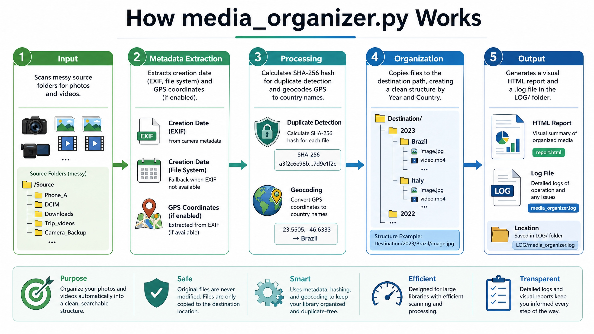
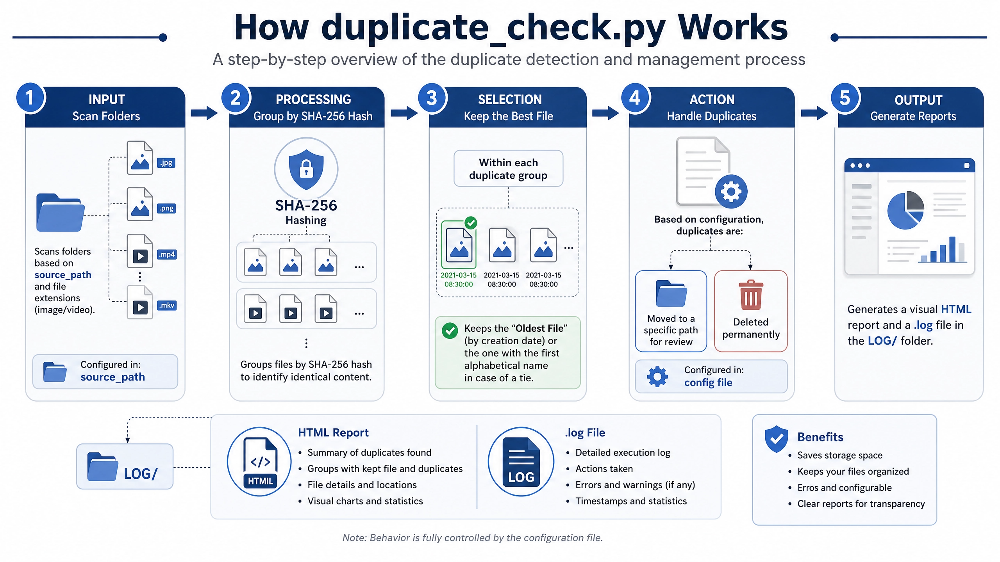
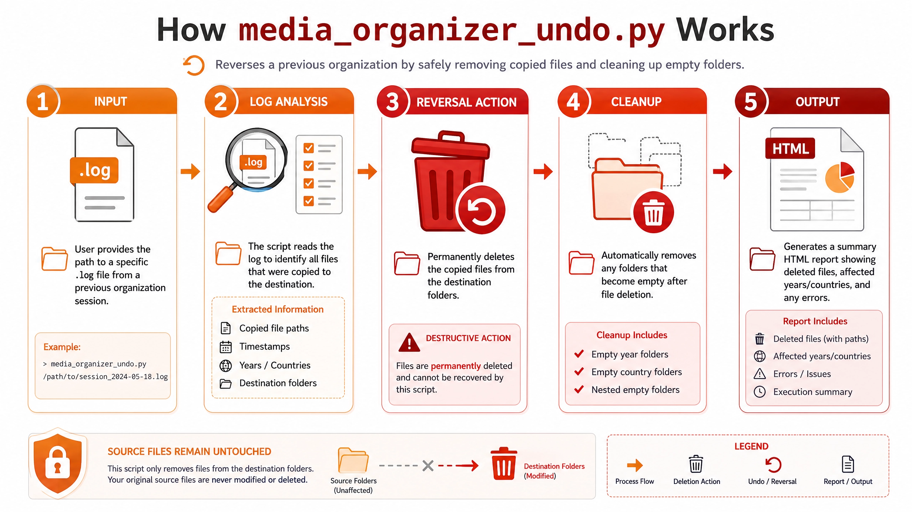

<!-- Logo -->

<p align="left">
  
</p>

# Media Organizer


> Turn a chaotic folder of photos and videos into a clean, year-and-country organized library — in a single command.

Media Organizer scans any unstructured collection of images and videos, extracts metadata (EXIF dates, GPS coordinates), detects duplicates by SHA-256 hash, and copies files into a consistent destination hierarchy. Includes tools to remove duplicates from an existing library and to safely undo any previous organization run.

---

## 📋 Table of Contents

- [✨ Features](#-features)
- [⚡ Quick Start](#-quick-start)
- [🔧 Installation](#-installation)
- [⚙️ Configuration](#️-configuration)
- [🚀 Usage](#-usage)
- [📁 Folder Structure](#-folder-structure)
- [🏗️ Architecture](#️-architecture)
- [📊 Reports](#-reports)
- [📄 License](#-license)

---

## ✨ Features

- 📅 Organize by **year** and/or **country** from GPS coordinates
- 🌍 GPS geocoding via OpenStreetMap — **no API key required**
- 📱 **HEIC** (iPhone) image support
- 🎬 **Video** date extraction via FFmpeg
- 🔒 **SHA-256** duplicate detection — within a run and against existing files
- 🗑️ Safe duplicate removal — move to a review folder or delete permanently
- 🔢 Optional **sequential file renaming**
- ↩️ **Undo** any previous organization session using its log file
- 📊 Detailed **HTML reports** with statistics, GPS breakdown, and errors
- 🗄️ SQLite **GPS cache** — avoids redundant geocoding requests
- ⚡ **Multi-threaded** processing
- 🛡️ **Non-destructive** — files are always copied, never moved from the source

---

## ⚡ Quick Start

```bash
# 1. Clone and install
git clone https://github.com/barneycatatau/photo_organizer.git
cd photo_organizer
pip install -r requirements.txt
```

Edit `config.cfg`:

```ini
source_path=D:\Photos\Unsorted
destination_path=D:\Photos\Organized
```

```bash
# 2. Run
python media_organizer.py
```

Open `LOG/media_organizer_*.html` to review the results.

---

## 🔧 Installation

### Clone the repository

```bash
git clone https://github.com/barneycatatau/photo_organizer.git
cd photo_organizer
```

### Install Python dependencies

```bash
pip install -r requirements.txt
```

| Package | Version | Purpose |
|---------|---------|---------|
| Pillow | ≥ 10.0.0 | EXIF extraction from images |
| pillow-heif | ≥ 0.13.0 | HEIC (iPhone) format support |
| geopy | ≥ 2.4.0 | GPS geocoding (required only when `GPS=yes`) |

### FFmpeg (Optional but Recommended)

FFmpeg enables accurate creation-date extraction from video files. Without it, the file modification date is used as a fallback.

```bash
# Cross-platform (easiest)
pip install imageio-ffmpeg

# Or system-wide:
# Windows:  download from ffmpeg.org and add to PATH
# Linux:    sudo apt-get install ffmpeg
# macOS:    brew install ffmpeg
```

Verify:

```bash
ffmpeg -version
```

---

## ⚙️ Configuration

All settings live in `config.cfg` under the `[PATHS]` section.

### Minimum required

```ini
source_path=D:\Media
destination_path=D:\OrganizedMedia
```

### Common options

| Option | Values | Description |
|--------|--------|-------------|
| `GPS` | `yes` / `no` | Geocode GPS coordinates to country names |
| `year_wise` | `yes` / `no` | Group files by year |
| `verify_before_copy` | `yes` / `no` | Skip files already present at the destination (SHA-256) |
| `rename_prefix` | prefix or `no` | Sequential renaming, e.g. `IMG_` → `IMG_0001.jpg` |
| `move_duplicate_to_path` | path or `no` | Move duplicates for review, or delete permanently |
| `undo` | log path or `no` | Log file used by `media_organizer_undo.py` |

📖 Full reference: [docs/Configuration.md](docs/Configuration.md)

---

## 🚀 Usage

### Organize media

```bash
python media_organizer.py
```

### Remove duplicates

```bash
python duplicate_check.py
```

### Undo a previous organization

Set the log file in `config.cfg`:

```ini
undo=LOG\media_organizer_20260131_064337.log
```

Then run:

```bash
python media_organizer_undo.py
```

All scripts read the same `config.cfg` and write timestamped reports to `LOG/`.

📖 Step-by-step guide: [docs/Workflow.md](docs/Workflow.md)

---

## 📁 Folder Structure

Output structure depends on the `year_wise` and `GPS` settings:

| year_wise | GPS | Example output |
|-----------|-----|----------------|
| `yes` | `yes` | `2019/Brazil/photo.jpg` |
| `yes` | `no` | `2019/photo.jpg` |
| `no` | `yes` | `Brazil/photo.jpg` |
| `no` | `no` | `photo.jpg` |

---

## 🏗️ Architecture

### Media Organization Flow



For each file found in the source, the organizer:

1. Extracts the creation date in priority order: `DateTimeOriginal` → `DateTimeDigitized` → file modification date. The **oldest** value across all sources is used.
2. Resolves GPS coordinates to a country name via OpenStreetMap Nominatim (results are cached in a local SQLite database).
3. Calculates a SHA-256 hash for duplicate detection against files already in the destination.
4. Copies the file into the appropriate subfolder at the destination.

---

### Duplicate Detection Flow



The duplicate checker groups all files in the library by SHA-256 hash. Within each group, the **oldest file by creation date** is kept. In case of a date tie, the alphabetically earlier filename wins. All other files are moved or deleted according to `move_duplicate_to_path`.

---

### Undo Flow



The undo utility reads the `.log` file produced by a previous organization run, removes every file that was copied during that session, and deletes any folders that become empty. The source directory is never touched.

---

## 📊 Reports

Every script generates a timestamped `.log` and `.html` report in the `LOG/` directory.

| Script | Report |
|--------|--------|
| `media_organizer.py` | `LOG/media_organizer_*.html` |
| `duplicate_check.py` | `LOG/duplicate_check_*.html` |
| `media_organizer_undo.py` | `LOG/media_organizer_undo_*.html` |

Reports include processing statistics, GPS country breakdown, folder structure summary, ignored files, and any errors encountered.

📖 Report reference: [docs/Report.md](docs/Report.md)

---

## 📄 License

This project is licensed under the MIT License. See the [LICENSE](LICENSE) file for details.
