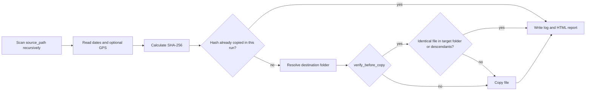
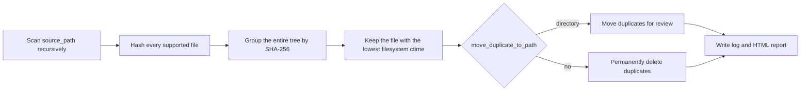

<!-- Logo -->

<p align="left">
  
</p>

# Media Organizer


> Turn a chaotic folder of photos and videos into a clean, year-and-country organized library — in a single command.

Media Organizer scans any unstructured collection of images and videos, extracts metadata (EXIF dates, GPS coordinates), detects duplicates by SHA-256 hash, and copies files into a consistent destination hierarchy. Includes tools to remove duplicates from an existing library and to safely undo any previous organization run.

---

## 📋 Table of Contents

- [✨ Features](#-features)
- [🛡️ Safety](#️-safety)
- [⚡ Quick Start](#-quick-start)
- [🔧 Installation](#-installation)
- [⚙️ Configuration](#️-configuration)
- [🚀 Usage](#-usage)
- [📁 Folder Structure](#-folder-structure)
- [🏗️ Architecture](#️-architecture)
- [📊 Reports](#-reports)
- [📄 License](#-license)

---

## ✨ Features

- 📅 Organize by **year** and/or **country** from GPS coordinates
- 🌍 GPS geocoding via OpenStreetMap — **no API key required**
- 📱 **HEIC** (iPhone) image support
- 🎬 **Video** date extraction via FFmpeg
- 🔒 **SHA-256** duplicate detection — across the current import and within each resolved destination folder
- 🗑️ Safe duplicate removal — move to a review folder or delete permanently
- 🔢 Optional **sequential file renaming**
- ↩️ **Undo** any previous organization session using its log file
- 📊 Detailed **HTML reports** with statistics, GPS breakdown, and errors
- 🗄️ SQLite **GPS cache** — avoids redundant geocoding requests
- ⚡ **Multi-threaded** processing
- 🛡️ **Non-destructive organizer** — `media_organizer.py` only copies from the source

---

## 🛡️ Safety

The three commands have different effects on files:

| Command | Effect |
|---------|--------|
| `media_organizer.py` | Copies supported media to the destination. It does not modify the source. |
| `duplicate_check.py` | Scans the entire `source_path` tree and **moves or permanently deletes** duplicate copies. |
| `media_organizer_undo.py` | **Permanently deletes** destination files recorded in a selected organizer log. |

For duplicate cleanup, set `move_duplicate_to_path` to a review directory outside `source_path`. Use `move_duplicate_to_path=no` only when permanent deletion is intentional.

---

## ⚡ Quick Start

```bash
git clone https://github.com/barneycatatau/Media_Organizer.git
cd photo_organizer
pip install -r requirements.txt
```

Create a local configuration file. It is ignored by Git:

```powershell
# Windows PowerShell
Copy-Item config.cfg.example config.cfg
```

```bash
# Linux / macOS
cp config.cfg.example config.cfg
```

Edit `config.cfg` and set at least:

```ini
source_path=D:\Photos\Unsorted
destination_path=D:\Photos\Organized
```

```bash
python media_organizer.py
```

Open `LOG/media_organizer_*.html` to review the results.

---

## 🔧 Installation

### Clone the repository

```bash
git clone https://github.com/barneycatatau/Media_Organizer.git
cd photo_organizer
```

### Install Python dependencies

```bash
pip install -r requirements.txt
```

| Package | Version | Purpose |
|---------|---------|---------|
| Pillow | ≥ 10.0.0 | EXIF extraction from images |
| pillow-heif | ≥ 0.13.0 | HEIC (iPhone) format support |
| geopy | ≥ 2.4.0 | GPS geocoding (required only when `GPS=yes`) |

### FFmpeg (optional but recommended)

FFmpeg enables accurate creation-date extraction from video files. Without it, the file modification date is used as a fallback.

```bash
# Linux
sudo apt-get install ffmpeg

# macOS
brew install ffmpeg
```

On Windows, install FFmpeg from [ffmpeg.org](https://ffmpeg.org/download.html) and add its `bin` directory to `PATH`.

Verify:

```bash
ffprobe -version
```

---

## ⚙️ Configuration

All settings live in `config.cfg` under the `[PATHS]` section.

### Paths to customize

```ini
source_path=D:\Media
destination_path=D:\OrganizedMedia
```

Start from `config.cfg.example`; the organizer also requires non-empty `organize_image_extensions` and `organize_video_extensions` lists.

### Common options

| Option | Values | Description |
|--------|--------|-------------|
| `GPS` | `yes` / `no` | Geocode GPS coordinates to country names |
| `year_wise` | `yes` / `no` | Group files by year |
| `verify_before_copy` | `yes` / `no` | Skip identical files already present in the resolved destination folder (SHA-256) |
| `network_username` | username or blank | Windows account used to connect to a UNC destination |
| `network_password` | password or blank | Password for `network_username` |
| `network_domain` | domain or blank | Optional Windows domain/workgroup |
| `rename_prefix` | prefix or `no` | Sequential renaming, e.g. `IMG_` → `IMG_0001.jpg` |
| `move_duplicate_to_path` | path or `no` | Move duplicates for review, or delete permanently |
| `undo` | log path or `no` | Log file used by `media_organizer_undo.py` |

📖 Full reference: [docs/Configuration.md](docs/Configuration.md)

---

## 🚀 Usage

### Organize media

```bash
python media_organizer.py
```

### Remove duplicates across a directory tree

`duplicate_check.py` groups matching SHA-256 hashes across every supported file below `source_path`. It modifies that tree: duplicates are moved when `move_duplicate_to_path` is a path, or permanently deleted when it is `no`.

Use a review directory outside `source_path`:

```ini
source_path=D:\MediaLibrary
move_duplicate_to_path=D:\DuplicateReview
```

```bash
python duplicate_check.py
```

### Undo a previous organization

Set the log file in `config.cfg`:

```ini
undo=LOG\media_organizer_20260131_064337.log
```

Then run:

```bash
python media_organizer_undo.py
```

All scripts read the same `config.cfg` and write timestamped reports to `LOG/`.

📖 Step-by-step guide: [docs/Workflow.md](docs/Workflow.md)

---

## 📁 Folder Structure

Output structure depends on the `year_wise` and `GPS` settings:

| `year_wise` | `GPS` | GPS result | Example output |
|-------------|-------|------------|----------------|
| `yes` | `yes` | Country found | `2019/Brazil/photo.jpg` |
| `yes` | `yes` | No country | `2019/photo.jpg` |
| `yes` | `no` | Not used | `2019/photo.jpg` |
| `no` | `yes` | Country found | `Brazil/Phone/DCIM/photo.jpg` |
| `no` | `yes` | No country | `Phone/DCIM/photo.jpg` |
| `no` | `no` | Not used | `Phone/DCIM/photo.jpg` |

When `year_wise=yes`, the original source folders are not reproduced. When `year_wise=no`, their paths relative to `source_path` are preserved. Empty source folders are not copied.

---

## 🏗️ Architecture

### Media Organization Flow



For each file found in the source, the organizer:

1. Connects to a Windows UNC share when credentials are configured and verifies that the destination is writable.
2. Extracts available EXIF/video and filesystem dates and uses the earliest valid year.
3. Resolves GPS coordinates to a country name via OpenStreetMap Nominatim (results are cached in a local SQLite database). Worker failures and excessive waits are logged instead of blocking a media-processing worker forever.
4. Calculates a SHA-256 hash. A run-wide index skips identical source files even when they came from different subfolders. When `verify_before_copy=yes`, a second index checks files already present in the resolved destination folder and its descendants; it does not search unrelated year or country folders. Indexing progress and cache reuse are shown in the console and log.
5. Copies the file into the appropriate subfolder at the destination.

---

### Duplicate Detection Flow



The comparison covers all supported files below `source_path`, including files in different subfolders. Only byte-for-byte identical content has the same SHA-256 hash; visually similar or re-encoded media is not considered a duplicate. Within each group, the file with the lowest filesystem `ctime` is kept (creation time on Windows; metadata-change time on Unix-like systems). A tie is resolved by the case-insensitive filename. Moved duplicates retain their path relative to `source_path` below the review directory.

---

### Undo Flow


The undo utility reads the `.log` file produced by a previous organization run, removes every file that was copied during that session, and deletes any folders that become empty. The source directory is never touched.

---

## 📊 Reports

Every script generates a timestamped `.log` and `.html` report in the `LOG/` directory.

| Script | Report |
|--------|--------|
| `media_organizer.py` | `LOG/media_organizer_*.html` |
| `duplicate_check.py` | `LOG/duplicate_check_*.html` |
| `media_organizer_undo.py` | `LOG/undo_*.html` |

Reports include statistics, configuration details, affected paths, and errors appropriate to each command.

📖 Report reference: [docs/Report.md](docs/Report.md)

---

## 📄 License

This project is licensed under the MIT License. See the [LICENSE](LICENSE) file for details.
